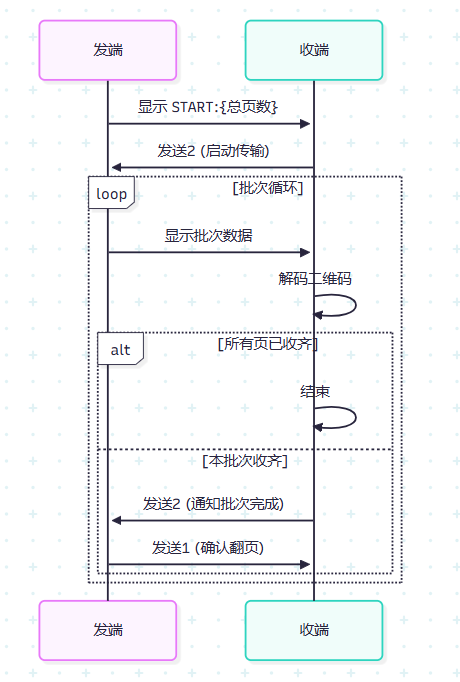

# QRCast

**QRCast** 是一个基于二维码的文件传输工具，适用于同一台电脑上内外网数据隔离的场景，尤其在云桌面环境中非常方便。灵感参考自 [qrtransfer](https://github.com/codingmiao/qrtransfer)。

QRCast 允许在配置文件中灵活切换 **2x2** 或 **3x3** 的二维码拼接传输模式，从而实现更高的传输速率。

---

## 🌟 Features / 特性

- 📁 文件分片传输，安全隔离
- 🖥️ 适配云桌面/远程桌面环境
- ⚡ 支持多二维码 (2x2 / 3x3) 批量传输
- 🛠️ 简单配置文件控制参数

---

## 🚀 Usage / 使用方式

### 1️⃣ 配置要传输的文件

编辑 `config.py`：

```python
TARGET_FILE = "your_file_path"
QR_MODE = "2x2"   # 可选: "2x2", "3x3"
```

### 2️⃣ 启动发送端

```bash
python Sender/main_sender.py
```

### 3️⃣ 启动接收端

```bash
python Recver/main_receiver.py
```

接收端会自动解码并重组文件。

---

## 🔄 工作流程

以下流程示意图：


---


---

## 💡 Tips

- 建议在分辨率较高的屏幕上运行以保证二维码清晰度。
- 接收端可根据需要调整相机/屏幕窗口大小。

---


## 🙌 Acknowledgement

参考项目: [qrtransfer](https://github.com/codingmiao/qrtransfer)


